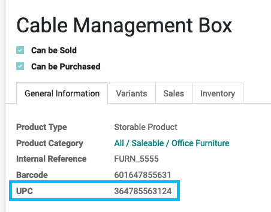

Product Barcode UPC
===================
- Add the UPC field to model Product Template & Product Variant
- Add the UPC field in the search for Product Template & Product Variant
- Add the Barcode and UPC filter in the predefined filters
- Enriches the search by barcode scanner in Barcode App & Inventory App (Inventory Adjustments & Inventory Operations)

Limitations
-----------
- This module only covers modifying the search for the cases described above. If the customer decides to use new features using the barcode scanner, it is possible that an adjustment (for example if a new article search function is used) is necessary.
- The module does not cover modifying the label reports for adding the second barcode.

Configuration
-------------
No configuration required apart from module installation.

Contributors
------------
* Numigi (tm) and all its contributors (https://bit.ly/numigiens)
* Komit (https://komit-consulting.com)

More information
----------------
* Meet us at https://bit.ly/numigi-com
