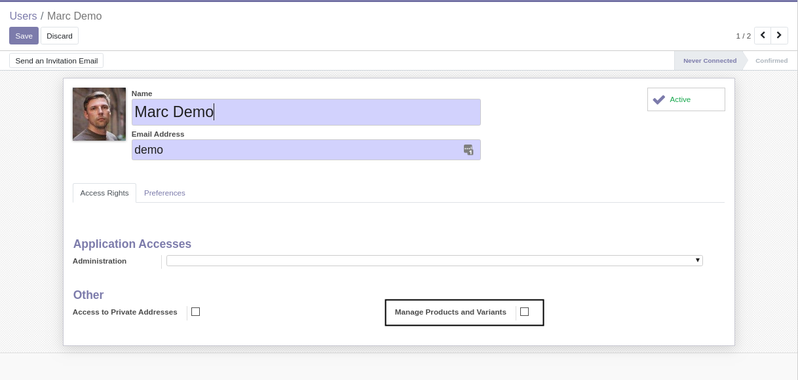

Product Create Group
====================

This module adds a group to create / edit products and variants.

Context
-------
In vanilla Odoo, only the manager groups are allowed to create or edit products.

In some cases, you may want to allow other users to create or edit products without
having to grant these full manager access over an application.

Module Design
-------------
The module grants every internal user the access to create and edit products.

Then, it adds `Extended Security Rules <https://github.com/Numigi/odoo-base-addons/tree/12.0/base_extended_security>`_
to limit this access to the new group ``Manage Products and Variants``.

Contributors
------------

The `Numigi <https://numigi.com/r/home>`_ team is the contributor to this project. We help Quebec companies implement Odoo and Konvergo ERP.

