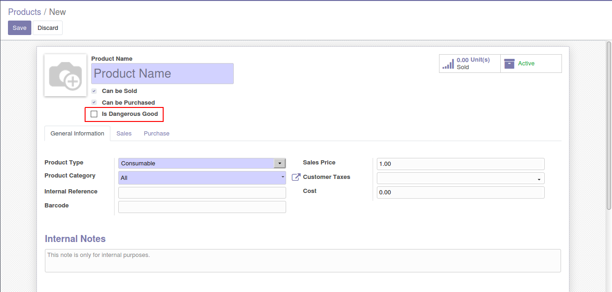
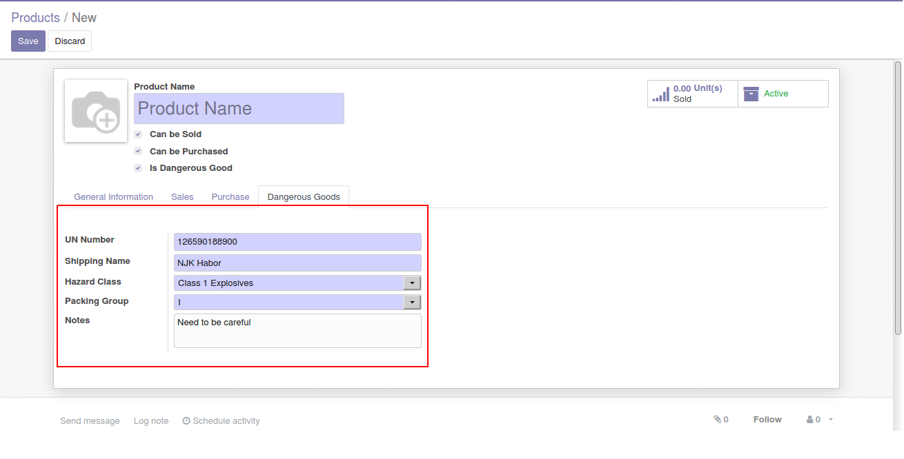

Product Dangerous Goods
=======================

Description
-----------

This module adds a new option "Is Dangerous Goods" on template and variant form

This module also adds these fields: UN number, shipping name, Hazard class, Packing group and only shown when "Is Dangerous Goods" is checked

Configuration
-------------

No configuration required apart from module installation.

Contributors
------------
* Numigi (tm) and all its contributors (https://bit.ly/numigiens)
* Komit (https://komit-consulting.com)

More information
----------------
* Meet us at https://bit.ly/numigi-com
