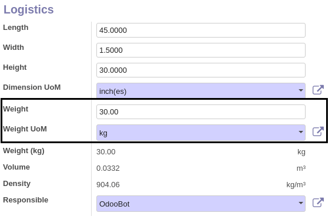

Product Dimension
=================
This module adds extra measure fields to products.

Dimension Fields
----------------
The module adds the fields `Width`, `Height` and `Length`.

A new decimal precision `Product Dimension` is defined for these fields.

A field is added for the unit of measure of the dimensions.

Weight
------
The weight already exist in Odoo. However, Odoo specifies that the weight must be the same for all products (kg or lbs).

Therefore, the module adds a new `Weight` field (technically named `weight_in_uom`).
Another field is added to contain the unit of measure for the weight.
The new fields are added to the form view.

The old field is renamed `Weight in Kg`.
It is readonly and automatically filled from the value entered in the new field.

Note that this module is incompatible with the weight in pound setting:

Volume
------
The field `Volume` already exist in Odoo.

The module makes the field readonly and computed based on the dimension fields:

`Volume = Width * Height * Length`

The volume is always expressed in meters. This is standard in Odoo.

Density
-------
The field `Density` is added to products.
The density is expressed in kilogram per cubic meters (kg/m³).

It is computed from the volume and the weight:

`Density = Volume / Weight`

.. image:: ./static/description/density_fields.png

Contributors
------------
* Numigi (tm) and all its contributors (https://bit.ly/numigiens)
* Agathe Mollé (agathe.molle@savoirfairelinux.com)

More information
----------------
* Meet us at https://bit.ly/numigi-com
