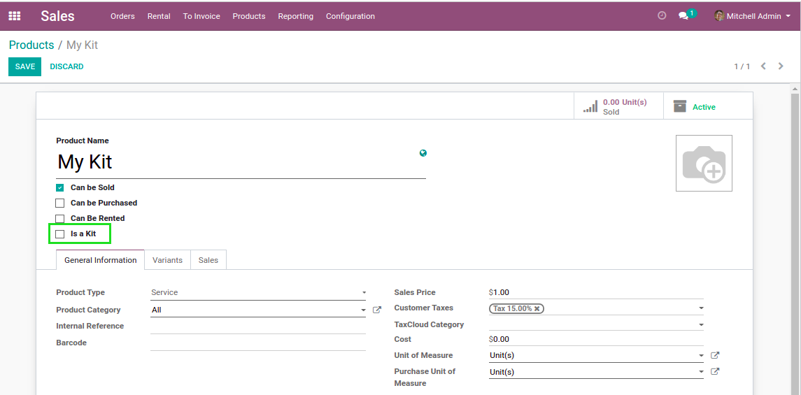
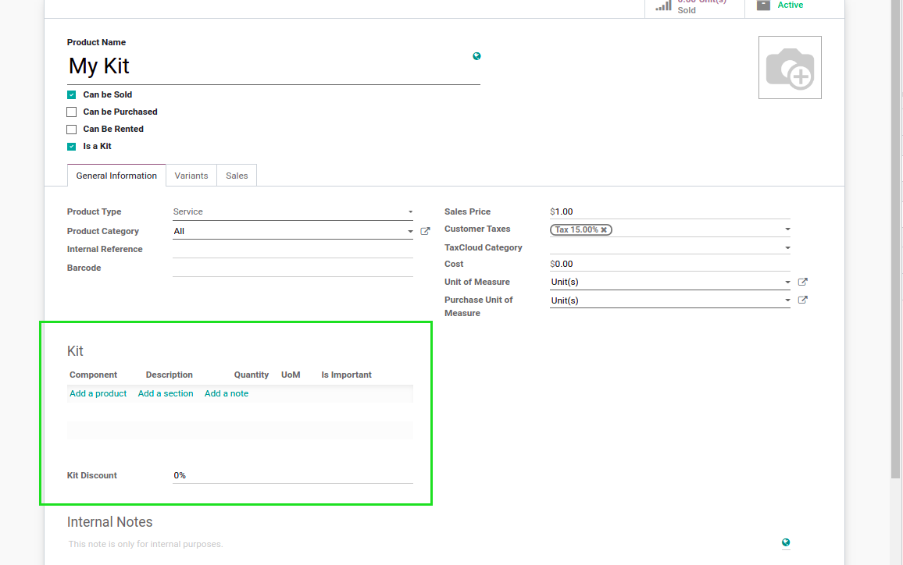
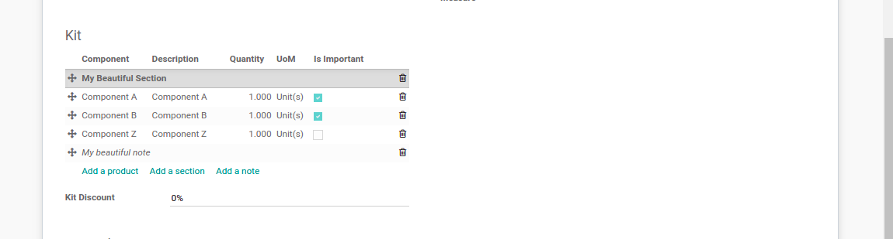
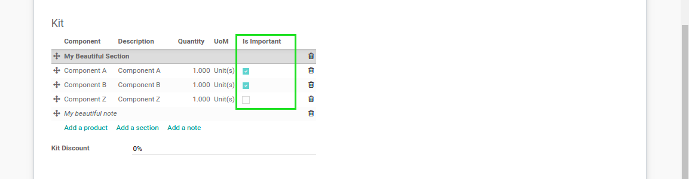
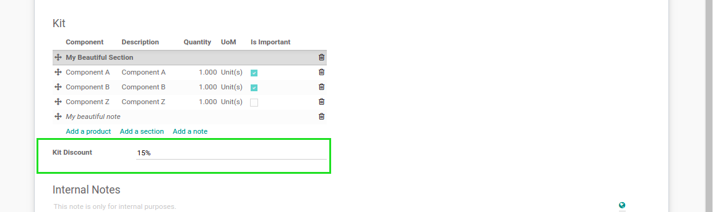

Product Kit
===========
This module allows to define a product as a kit.

.. contents:: Table of Contents

Overview
--------
The module adds a new field ``Is a Kit`` on products.

When the box is checked, a new ``Kit`` bloc appears.

You may add products, sections and notes to a kit.

Components
----------
Products in a kit are called ``Components``.

Important Components
~~~~~~~~~~~~~~~~~~~~
A component can be flagged as ``Important``:

An important component means that the kit can not be sold / rented without this component.
If the component is not important, it is optional.

Kit Discount
------------
Optionally, it is possible to define a discount on the kit.

It represents a discount to apply on each component of the kit,
versus buying each product separately.

Product Type
------------
A kit must be a service.

The reason is that kit itself does not generate stock moves.
The components that are products of type ``Stockable`` or ``Consumable`` will generate stock moves.

Contributors
------------
* Numigi (tm) and all its contributors (https://bit.ly/numigiens)

More information
----------------
* Meet us at https://bit.ly/numigi-com
