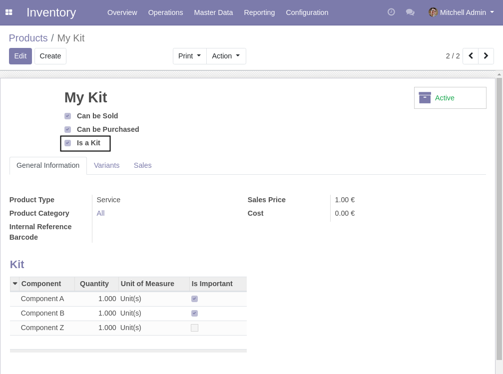
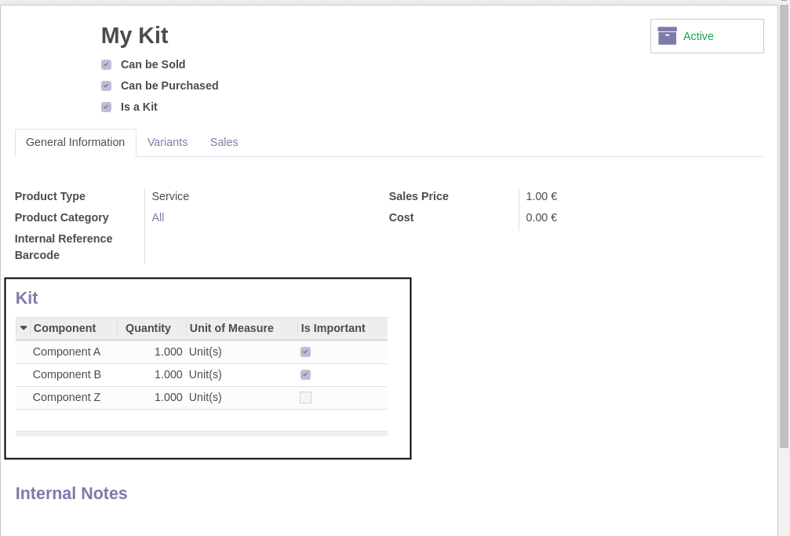
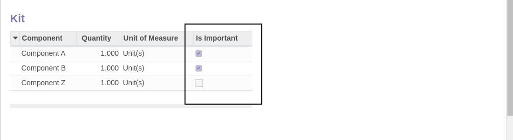

Product Kit
===========
This module allows to define a product as a kit.

.. contents:: Table of Contents

Components
----------
A kit has components.

Each component is a single product that is part of the kit.

A component can be flagged as ``Important``:

An important component means that the kit can not be sold / rented without this component.
If the component is not important, it is optional.

Product Type
------------
A kit must be a service.

The reason is that kit itself does not generate stock moves.
The components that are products of type ``Stockable`` or ``Consumable`` will generate stock moves.

Contributors
------------
* Numigi (tm) and all its contributors (https://bit.ly/numigiens)

More information
----------------
* Meet us at https://bit.ly/numigi-com
