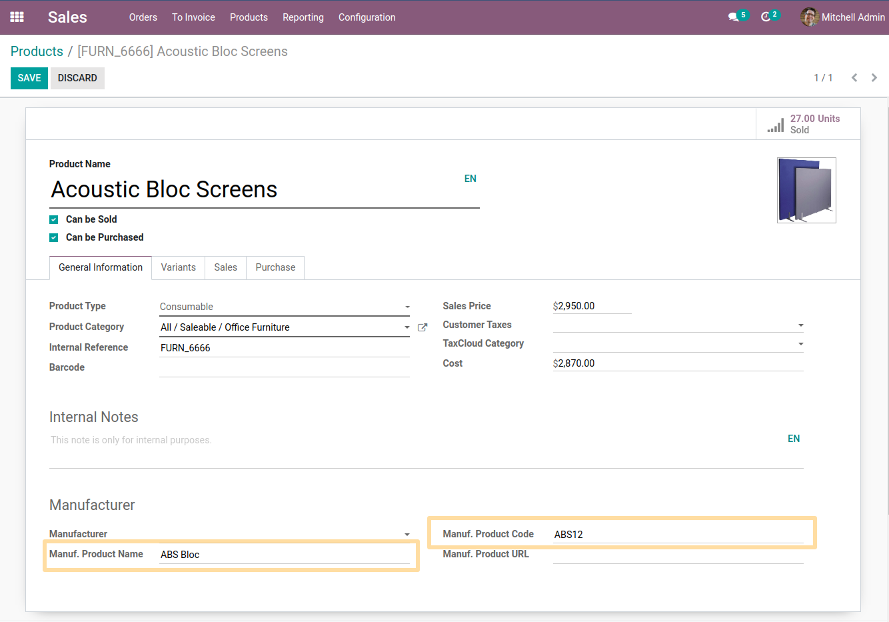
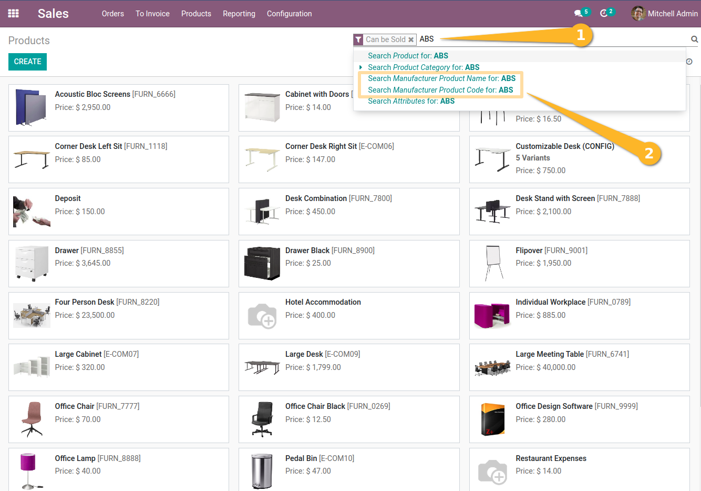
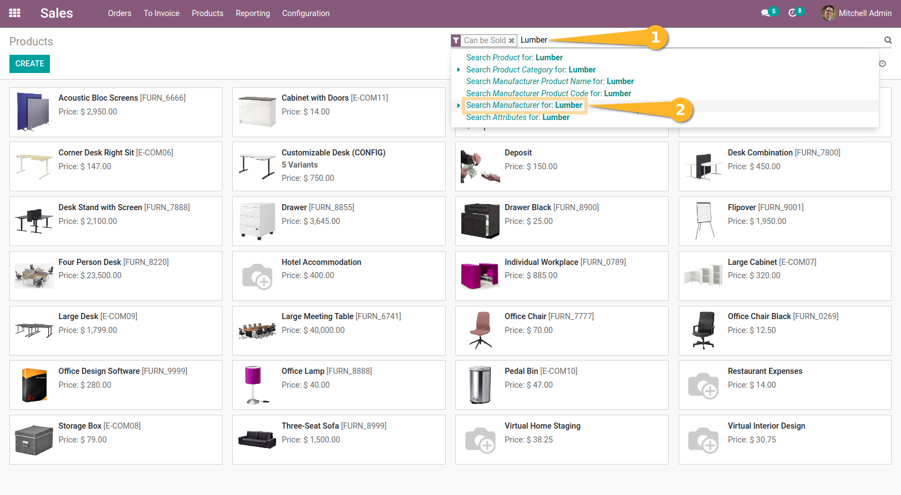
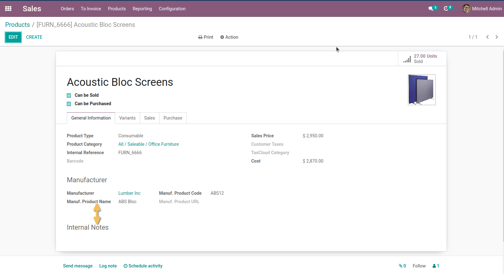

Product Manufacturer Quick Search
=================================
This module allows to make a a quick search for items using their manufacturer name or code, as well as the manufacturer name.

Usage
-----
Firstly, as a user with access to the products I find the manufacturer information section is above the note.

Then it is possible to carry out quick searches using the article name and the manufacturer's article code as well as the manufacturer's name:

In addition, if I search by the name of the manufacturer, I can find all product(s) concerned.

I also see that the place between manufacturer section and internal notes has changed.

Contributors
------------
* Numigi (tm) and all its contributors (https://bit.ly/numigiens)
