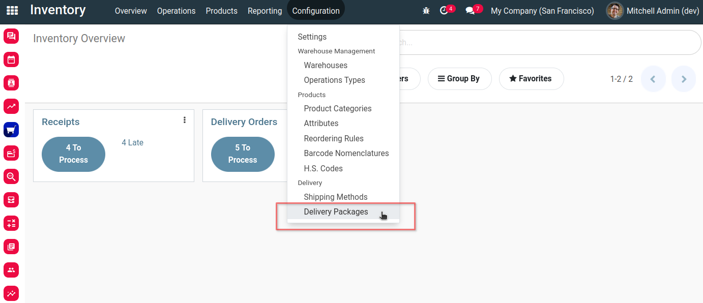
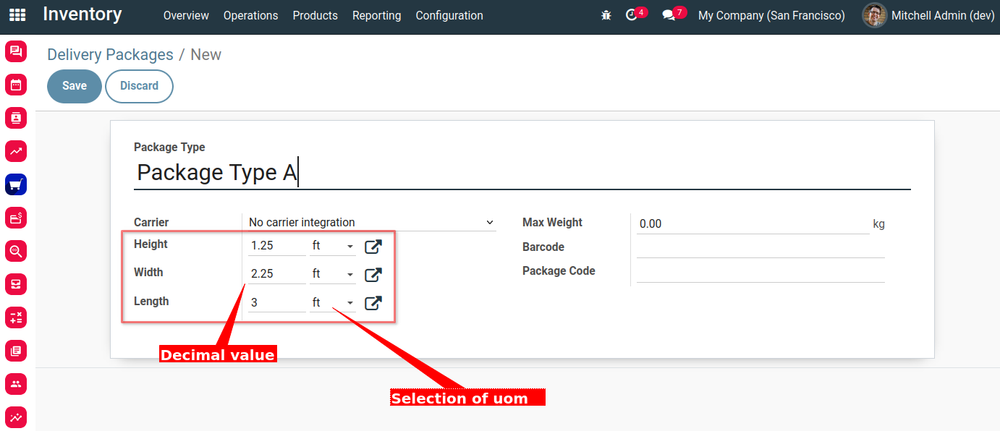

Product Packaging Dimension Decimal and Changeable UOM
======================================================
Add changeable UOM and allow decimal on product packaging.

Usage
-----
As an Administrator of Inventory, I go to ``Inventory > Configuration > Delivery Packages``.

In the form view, I can see that ``Height``, ``Width`` and ``Length`` can be in decimal value.
I also can change the unit of measure of each property to ``m`` or ``ft``.

Contributors
------------
* Numigi (tm) and all its contributors (https://bit.ly/numigiens)

More information
----------------
* Meet us at https://bit.ly/numigi-com
