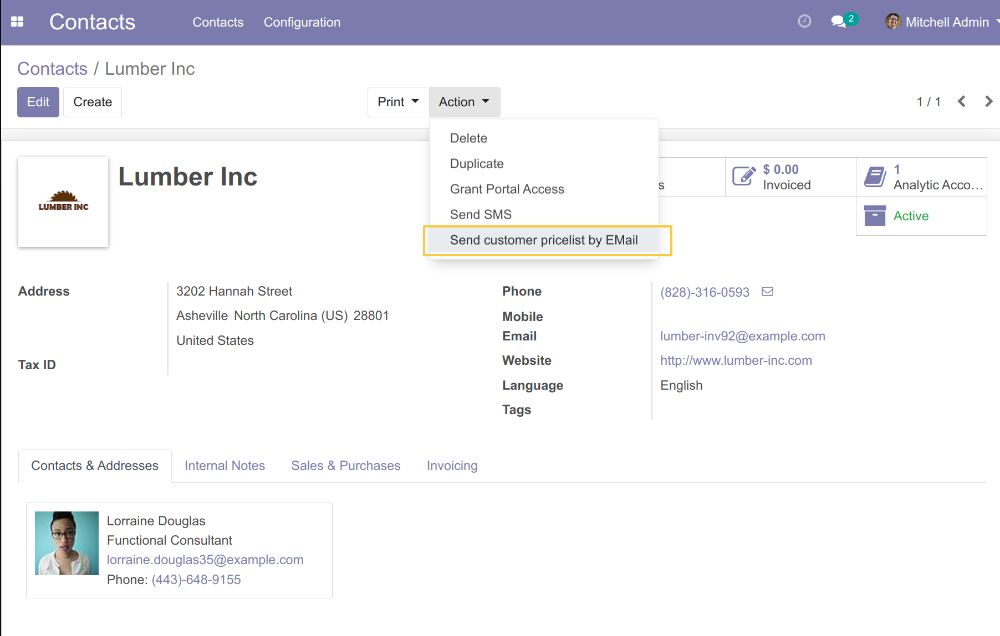
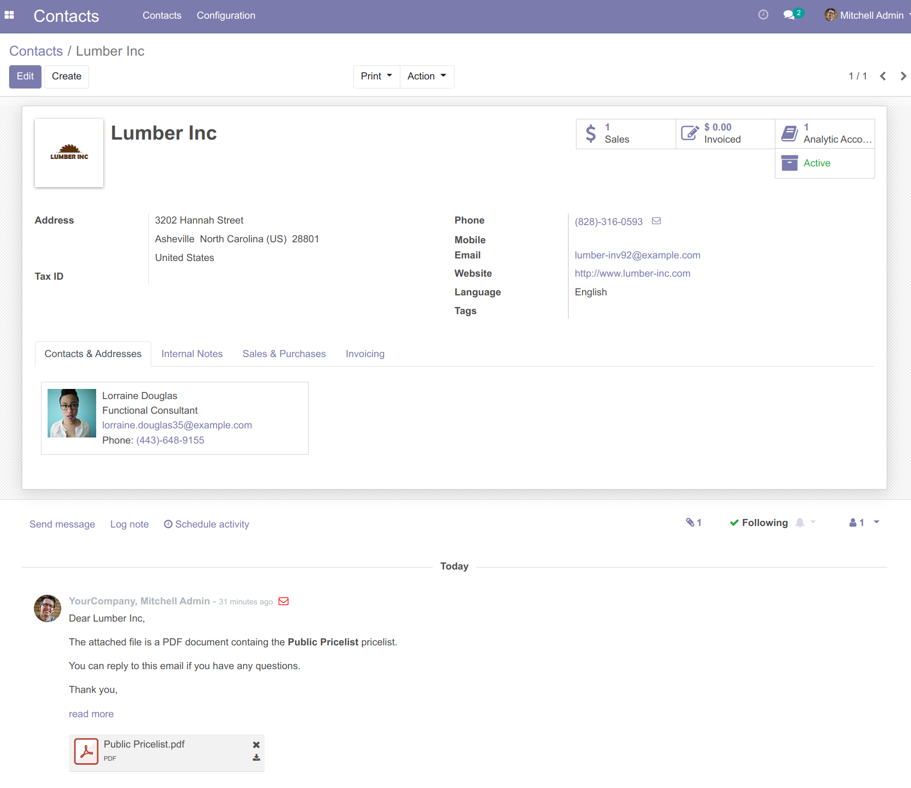

Product Pricelist Direct Print Chatter
======================================

Context
--------
The module `Product Pricelist Direct Print <https://github.com/OCA/product-attribute/tree/14.0/product_pricelist_direct_print>`_ allows you to send Products Pricelists to one or multiple partners.

The module doesn't log the sending of the price list email and the replies to the email in chatter.

Overview
--------
This module will trace the sending of the price list email in the contact's chatter,
then allow the customer to reply to the price list email and forward his response to his contact's chatter.

Usage
-----
From the list of contacts, I choose one or multiple contacts,
then I click on `Action / Send Customer Pricelist By EMail`

A wizard shows up, I fill the form then I click on the button `send by email`

The partner successfully receives the pricelist by email and the sending email
is logged in the chatter of the contact:

Contributors
------------
* Numigi (tm) and all its contributors (https://bit.ly/numigiens)

More information
----------------
* Meet us at https://bit.ly/numigi-com
