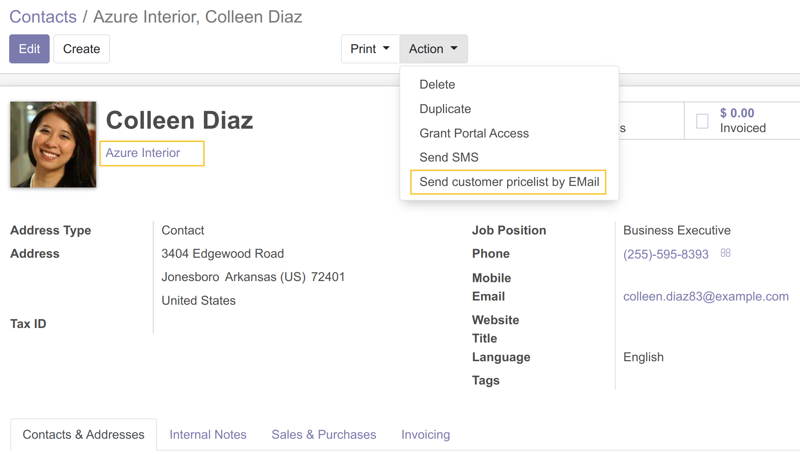
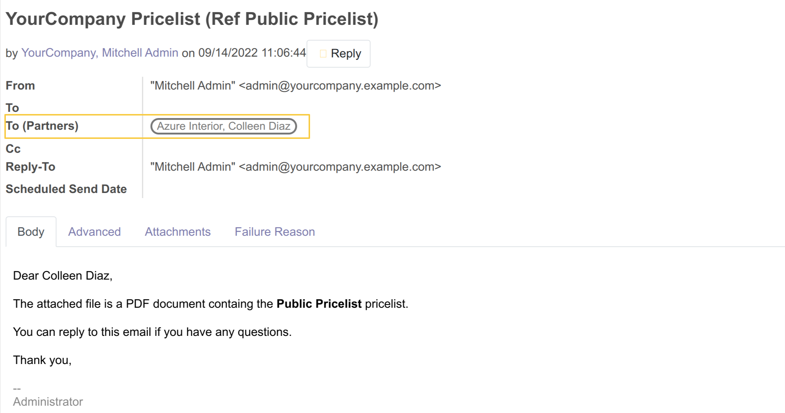

Product Pricelist Direct Print Extended
=======================================

Context
--------
The module `Product Pricelist Direct Print <https://github.com/OCA/product-attribute/tree/14.0/product_pricelist_direct_print>`_ allows you to send Products Prcielist to one or multiple partners.

The module adds a filter that allows you to send ``Product Pricelists`` only to Parent Partners.

Overview
--------
This module removes the filter by parent on partners while sending pricelist by mail.
Now even partners associated to an other contact can receive pricelist by email.

Usage
-----
From the list of contacts, I choose a contact associated to a company
then I click on ``Action / Send Customer Pricelist By EMail``

A wizard show up, I fill the form then I click on the button ``send by email``

The partner successfully receives the pricelist by EMail

Contributors
------------
* Numigi (tm) and all its contributors (https://bit.ly/numigiens)

More information
----------------
* Meet us at https://bit.ly/numigi-com
