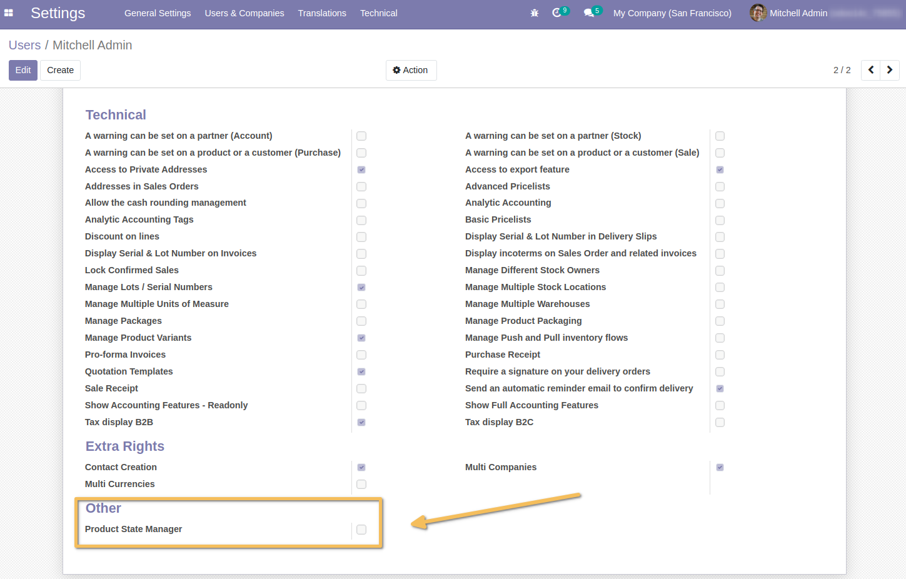
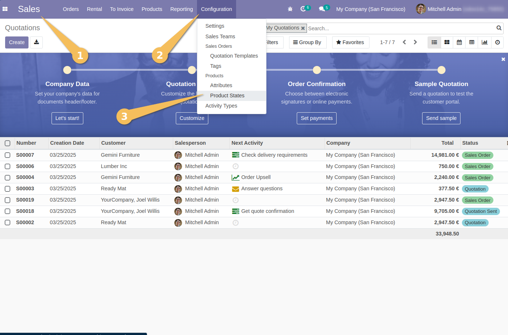
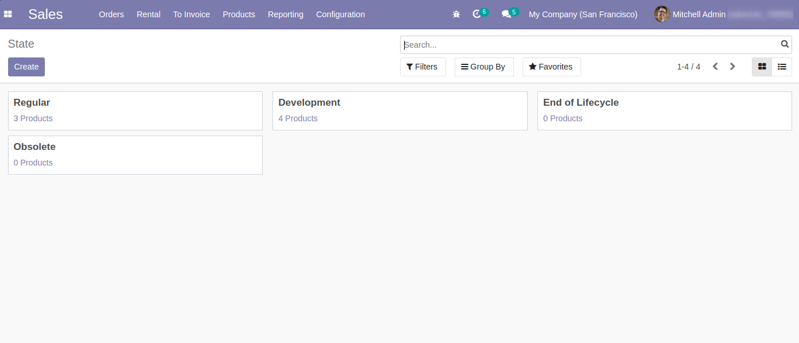
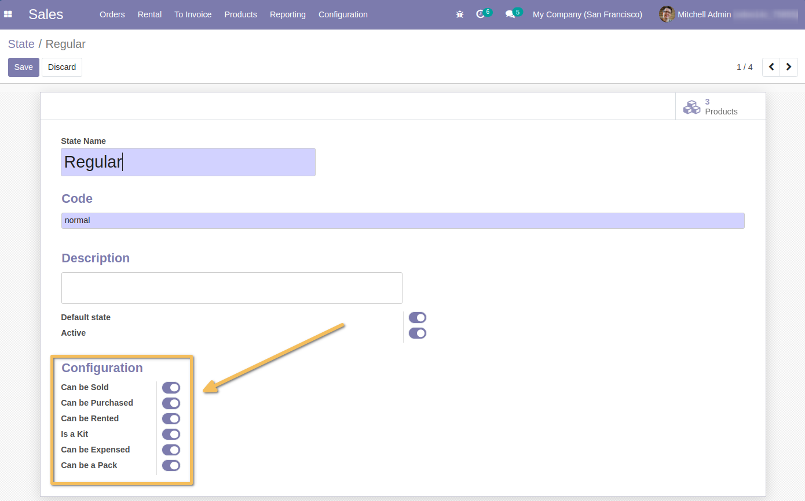
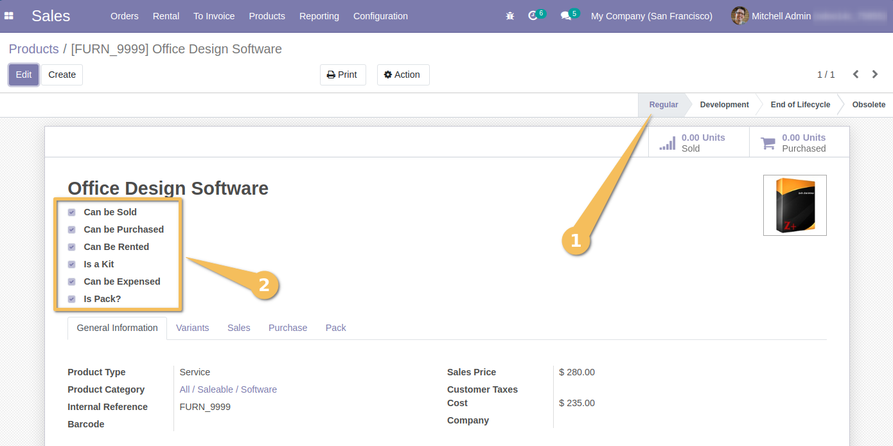
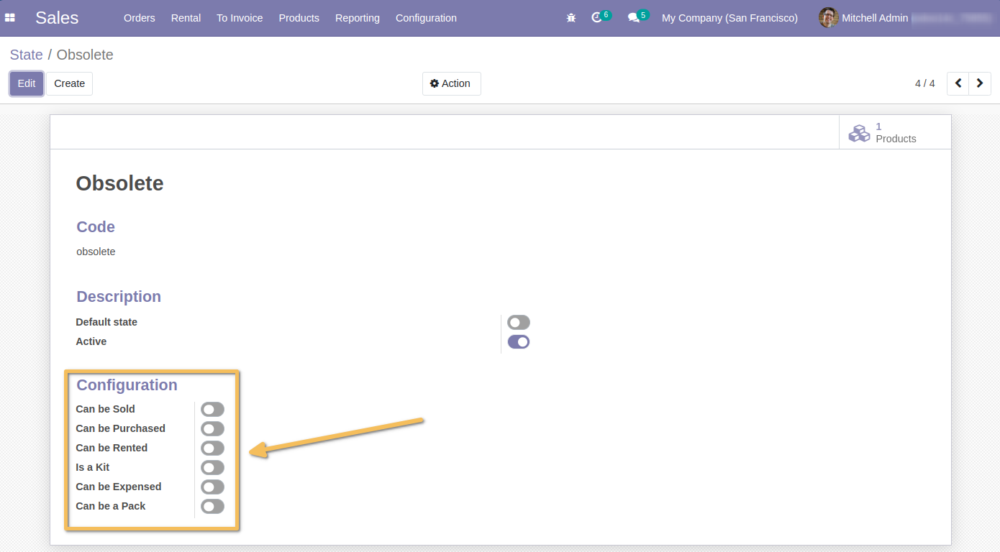
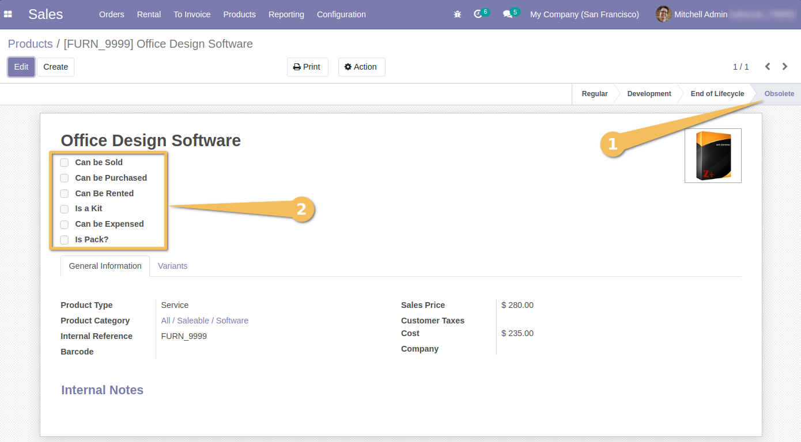
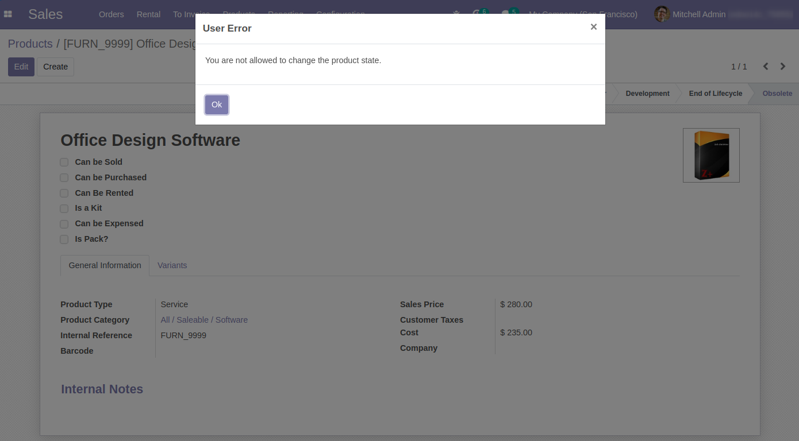

======================
Product State Extended
======================
This module helps to :
- Differentiate between design-phase product and other products
- Restrict the use of design-phase products in processes other than purchasing.

Usage
-----
As a user with access to `Users`, I check the user profile and see that a new access point is available (debug mode).
"Product State Manager"

As a user with Sales/Manager access:
I see a new submenu available, "Product States" in the Sales Configuration.

I see that there are product states already available by default.

I can change the configuration of a state.
And I make the change as confiuration of a state with the following options:
- `Can be Sold`
- `Can be Purchased`
- `Can be Rented`
- `Is a Kit`
- `Can be Expensed`
- `Can be a Pack`

I check that the configuration is correctly propagated to a product at this state.
The product automatically takes the configuration defined at the state.

As a user with the additional "Product State Manager" access rights, I can click on a state at the product level to change the state.
From "Regular" to "Obsolete" for example.
The product configuration is updated according to the configuration of the new state.

As a user without the additional "Product State Manager" access rights, I note that I can not change the product state.
I will have a message indicating that I do not have the necessary access rights if I try to change it.

Contributors
------------
* Numigi (tm) and all its contributors (https://bit.ly/numigiens)
