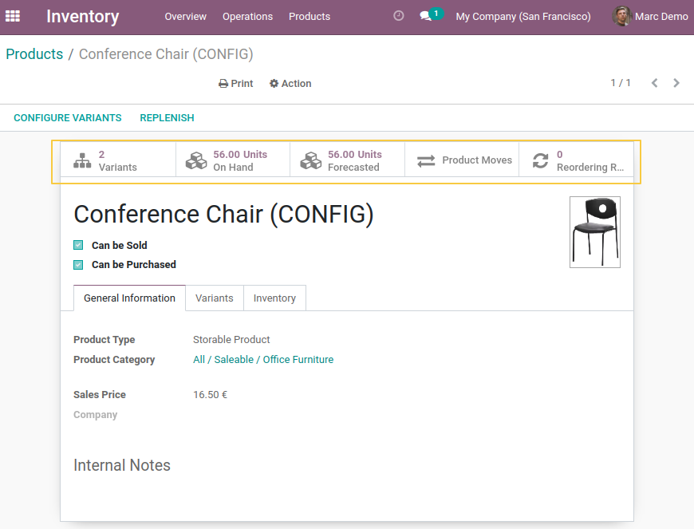

Product Stock Read Access Actions
=================================

Context:
--------

This module is a companion to the
`product_create_group <https://github.com/Numigi/odoo-product-addons/tree/14.0/product_create_group>`_ module.

Based on the `base_extended_security <https://github.com/Numigi/odoo-base-addons/blob/14.0/base_extended_security/README.rst#action-buttons>`_ module,

when a user has only read access to a specific model due to a Basic Rule, the action buttons on the form view are hidden.

After installing the module `product_create_group`, users with only Read access to Products and Product Templates will not see stock action buttons.

To allow these users to view the action buttons, we have added a hook provided by the `base_extended_security` module.

Description:
------------

As a user with group `Inventory/User` and with the `Manage Products and Variants` access unchecked. 

I display the form view of a Product ou Product Variants, I am now able to see and click on the stock Smart Buttons.

Contributors
------------
* Numigi (tm) and all its contributors (https://bit.ly/numigiens)

More information
----------------
* Meet us at https://bit.ly/numigi-com
