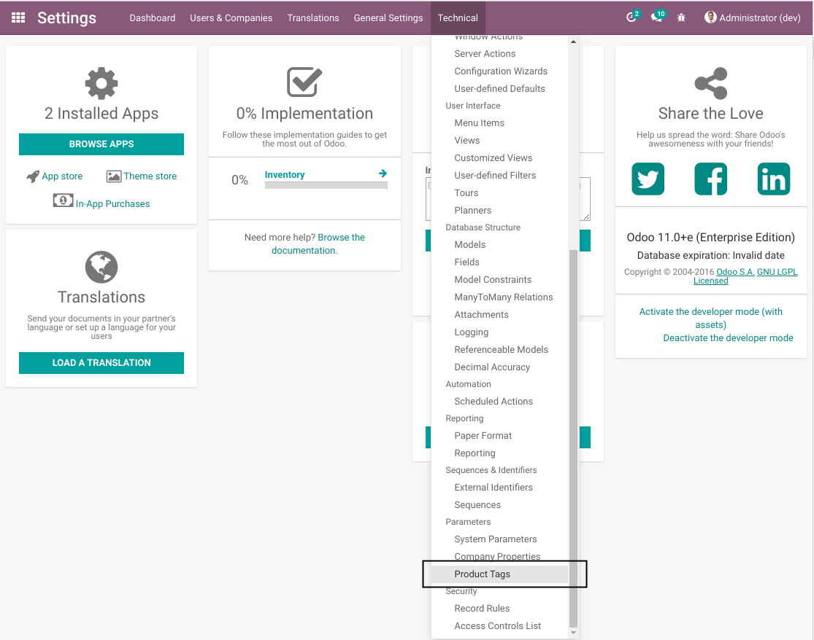
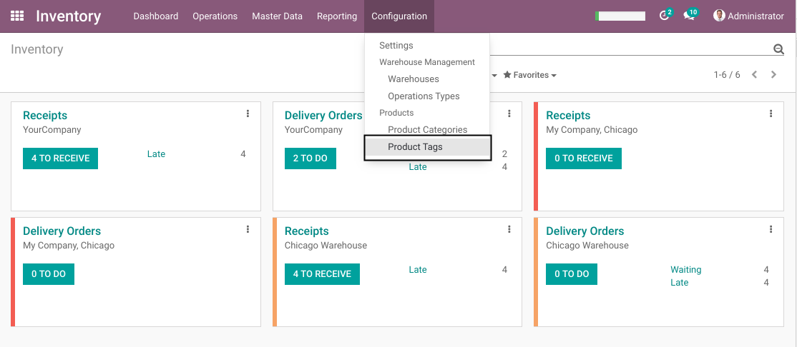

Product Template Tag Stock Menu
===============================
The module `product_template_tags <https://github.com/OCA/product-attribute/tree/11.0/product_template_tags>`_
adds tags to product templates. However, this module does not depend on the `Inventory` application.
Therefore, the menu entry to edit tag is placed in a very inconvenient menu.

After installing this module, the product template tags are accessible from the inventory application.

Contributors
------------
* Numigi (tm) and all its contributors (https://bit.ly/numigiens)
