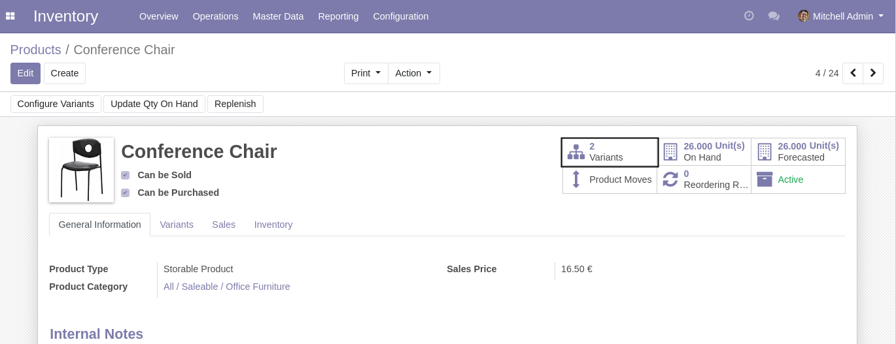
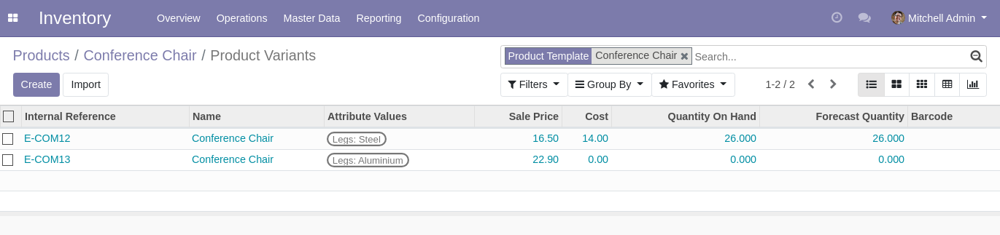
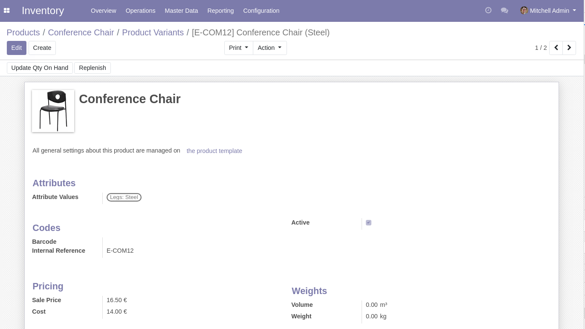
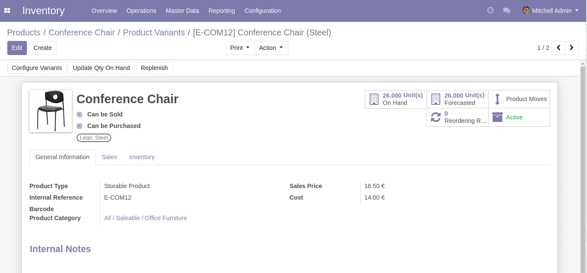

Product Variant Button Complete Form
====================================
In vanilla Odoo, when clicking on the ``Variants`` smart button of a product template,
the form view displayed is a simplified version.

After installing this module, the normal form view is displayed instead.

Contributors
------------
* Numigi (tm) and all its contributors (https://bit.ly/numigiens)

More information
----------------
* Meet us at https://bit.ly/numigi-com
