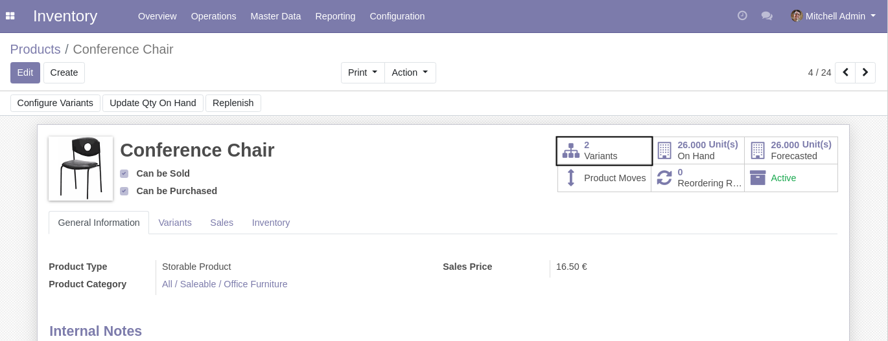
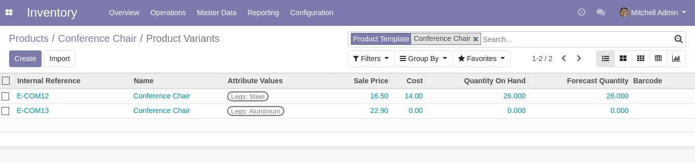
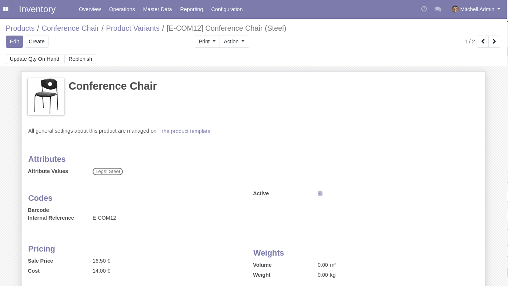
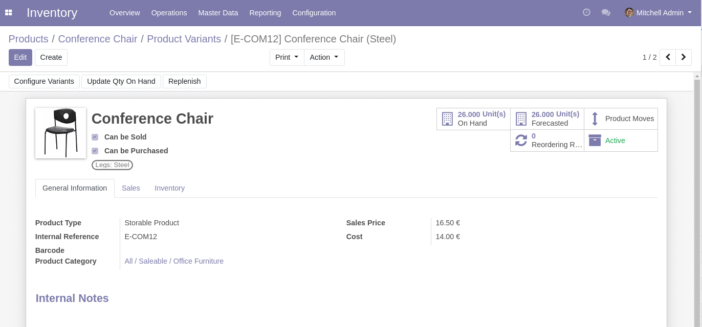

Product Variant Button Complete Form
====================================
In vanilla Odoo, when clicking on the ``Variants`` smart button of a product template,
the form view displayed is a simplified version.

After installing this module, the normal form view is displayed instead.

Contributors
------------

The `Numigi <https://numigi.com/r/home>`_ team is the contributor to this project. We help Quebec companies implement Odoo and Konvergo ERP.
